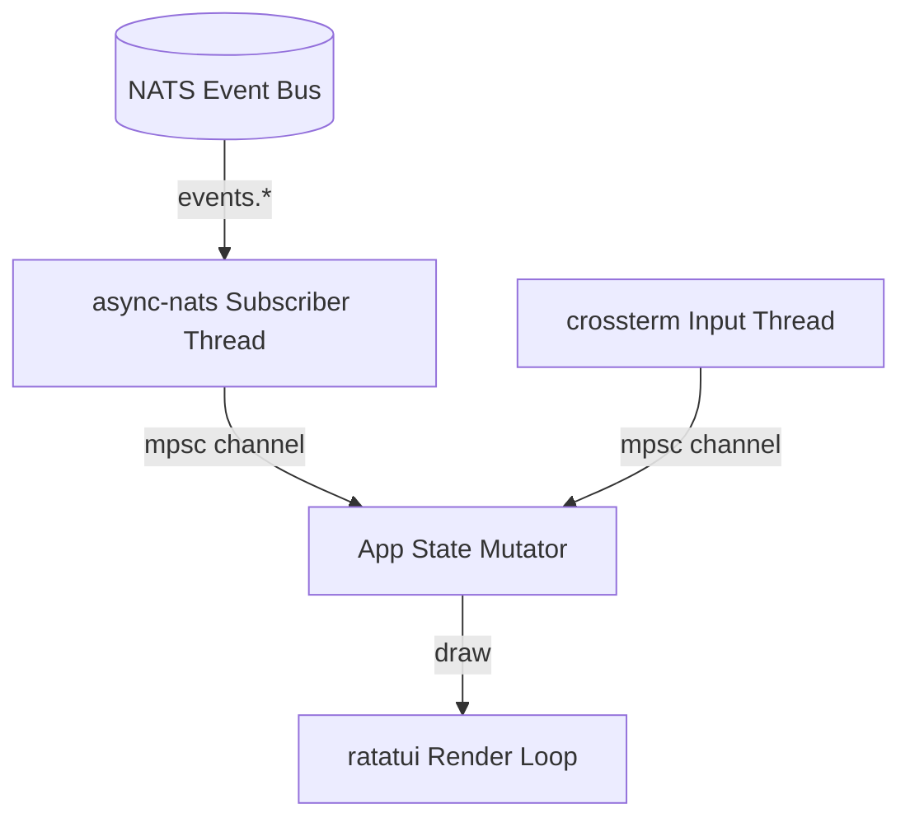

# Autonomic AI Terminal Dashboard (`agent-tui`)

A blazingly fast, multi-threaded Rust terminal user interface (TUI) for the Autonomic AI ecosystem. It connects directly to the local NATS event bus to give developers unprecedented visibility into agent execution without leaving the terminal.

## Features

- **Organ Health (Top)**: Real-time heartbeat tracking of CPU/Memory from `agent-heart`.
- **DAG Workflows (Left)**: Visualization of the deterministic DAG nodes actively executing in `agent-spine`.
- **Sandbox Logs (Right)**: Streaming standard output/error from `agent-muscle` code execution.
- **Context Routing (Bottom)**: Insights into memory chunks and rules retrieved by `agent-brain`.

## Installation

### Via Autonomic CLI (Recommended)
You do not need to clone this repository to use the TUI. The Autonomic CLI handles downloading the latest release for your architecture automatically:
```bash
autonomic tui
```

### Manual Build
Ensure you have Rust installed.
```bash
git clone https://github.com/autonomic-ai-dev/agent-tui.git
cd agent-tui
cargo build --release
./target/release/agent-tui
```

## Architecture



## Shortcuts
- `q` or `Esc`: Quit the TUI.
